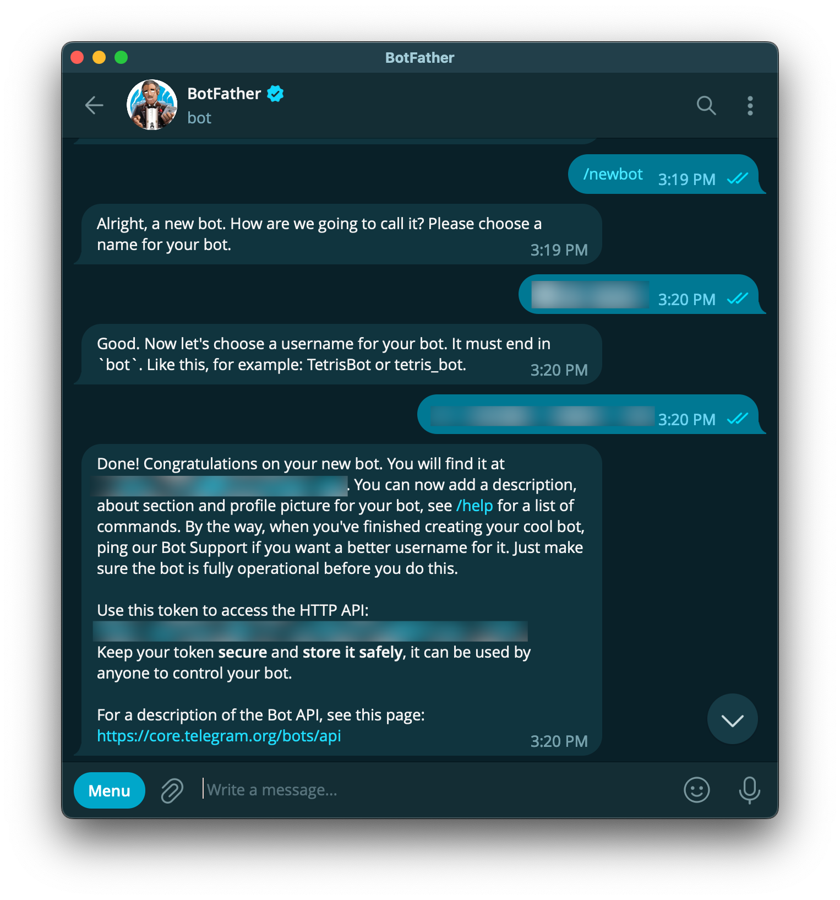
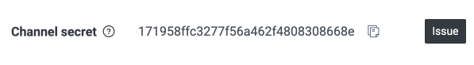
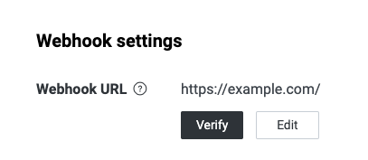
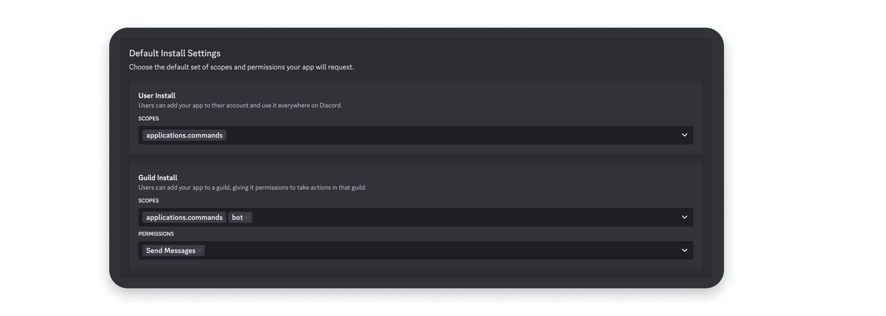
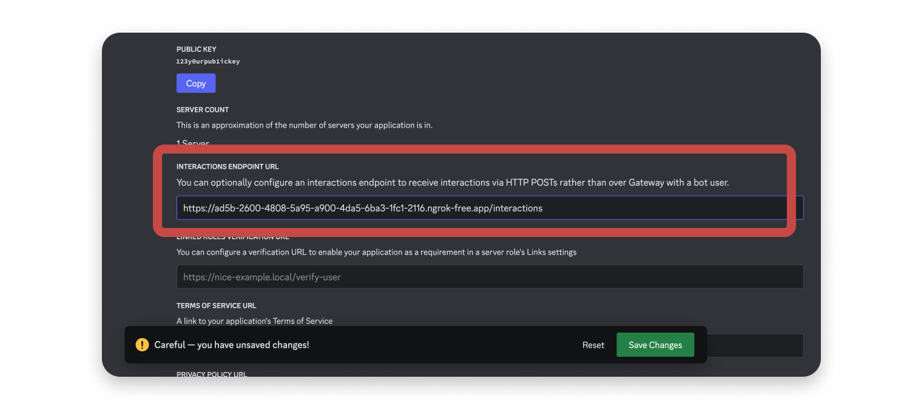

# คู่มือ Setup Telegram, LINE และ Discord

เอกสารนี้สรุปเฉพาะขั้นตอนเตรียมและตั้งค่า 3 ช่องทางสำหรับนำไปต่อยอดเป็น AI automation bot ภาพประกอบเป็นภาพตัวอย่างสำหรับอ้างอิงเท่านั้น ไม่ใช่ข้อมูลบัญชีจริงหรือ token ที่ใช้งานได้

## 1. Telegram

### 1.1 สร้าง Telegram bot

1. เปิด Telegram แล้วค้นหา @BotFather
2. ส่งคำสั่ง `/newbot`
3. ตั้งชื่อ bot และ username โดย username ต้องลงท้ายด้วย bot
4. เก็บ Bot Token ไว้ใน secret manager หรือ environment variable ห้ามใส่ไว้ใน source code
5. ตั้งค่า command เพิ่มได้ด้วย `/setcommands` เช่น `start`, `help` และ `ask`



_ภาพตัวอย่างหน้าสร้าง bot และ token ที่ปกปิดไว้ — แหล่งอ้างอิง: [TradeMade Telegram Bot Setup](https://docs.trademade.io/docs/prerequisites)_

### 1.2 ตั้งค่า Telegram webhook

กำหนด endpoint สำหรับรับข้อความ เช่น:

`https://<YOUR_DOMAIN>/api/webhook/telegram`

เรียก Telegram Bot API เพื่อตั้งค่า webhook:

```bash
curl -X POST "https://api.telegram.org/bot<TELEGRAM_BOT_TOKEN>/setWebhook" \
  -H "Content-Type: application/json" \
  -d '{
    "url": "https://<YOUR_DOMAIN>/api/webhook/telegram",
    "secret_token": "<TELEGRAM_WEBHOOK_SECRET>",
    "allowed_updates": ["message"]
  }'
```

การตรวจสอบที่ควรทำ:

- ตรวจ header `X-Telegram-Bot-Api-Secret-Token` ก่อนประมวลผล body
- ใช้ HTTPS เท่านั้น
- อย่าใช้ `getUpdates` พร้อมกับ webhook ใน production
- ตรวจสอบ duplicate update เพื่อป้องกันการตอบซ้ำเมื่อ Telegram retry

จุดเชื่อมต่อในโปรเจกต์ปัจจุบัน:

- Route: `src/app/api/webhook/telegram/route.ts`
- Helper: `src/lib/telegram.ts`

### 1.3 ทดสอบ Telegram

- ส่ง `/start` และข้อความภาษาไทย
- ส่งข้อความหลายบรรทัด อีโมจิ และข้อความยาว
- ส่งรูปพร้อม caption
- ทดลอง request ที่มี secret ไม่ถูกต้องและตรวจว่าถูกปฏิเสธ
- ทดลองกรณี AI API error แล้วตรวจว่าระบบตอบข้อความ fallback
- ทดลอง retry เดิมและตรวจว่าไม่สร้างผลลัพธ์ซ้ำ

เอกสารทางการ: [Telegram Bot API](https://core.telegram.org/bots/api) และ [Telegram Webhooks](https://core.telegram.org/bots/webhooks)

## 2. LINE

### 2.1 สร้าง LINE Official Account และ Messaging API channel

1. สร้างหรือเลือก LINE Official Account ที่ต้องการเชื่อมต่อ
2. เปิดใช้ Messaging API
3. เข้า [LINE Developers Console](https://developers.line.biz/console/)
4. สร้าง Provider หากยังไม่มี
5. เปิดหน้า channel แล้วบันทึก Channel Secret
6. ออก Channel Access Token และเก็บเป็น secret



_ภาพตัวอย่างหน้า Channel Secret — แหล่งอ้างอิง: [LINE Messaging API Getting Started](https://developers.line.biz/en/docs/messaging-api/getting-started/)_

### 2.2 ตั้งค่า LINE webhook

กำหนด endpoint สำหรับรับ event เช่น:

`https://<YOUR_DOMAIN>/api/webhook/line`

ขั้นตอนใน LINE Developers Console:

1. เปิดแท็บ Messaging API ของ channel
2. ใส่ Webhook URL
3. เปิด `Use webhook`
4. กด `Verify`
5. ส่งข้อความจาก LINE แล้วตรวจ event ที่ server ได้รับ



_ภาพตัวอย่างหน้า Webhook settings และปุ่ม Verify — แหล่งอ้างอิง: [LINE Messaging API Getting Started](https://developers.line.biz/en/docs/messaging-api/getting-started/)_

### 2.3 ตรวจสอบ LINE signature

ทุก request จาก LINE ควรตรวจ `x-line-signature` ก่อน parse หรือประมวลผลข้อมูล:

1. อ่าน raw request body โดยไม่เปลี่ยนรูปแบบ
2. ใช้ Channel Secret คำนวณ HMAC-SHA256
3. เปรียบเทียบผลลัพธ์กับค่า `x-line-signature` แบบ constant-time
4. ปฏิเสธ request ทันทีเมื่อ signature ไม่ตรง
5. Parse JSON หลังตรวจสอบสำเร็จเท่านั้น

เอกสารทางการ: [Verify webhook signature](https://developers.line.biz/en/docs/messaging-api/verify-webhook-signature/)

### 2.4 ตอบกลับและทดสอบ LINE

- ใช้ Channel Access Token เมื่อต้องเรียก LINE API
- ใช้ `replyToken` เพื่อตอบข้อความ และถือว่าใช้ได้ครั้งเดียว
- ดาวน์โหลดรูปจาก message ID ก่อนส่งเข้า pipeline ที่ต้องการวิเคราะห์ภาพ
- รองรับ event ที่ไม่ใช่ข้อความ เช่น follow, unfollow และ postback โดยไม่ทำให้ webhook ล้ม
- ทดสอบข้อความภาษาไทย หลายบรรทัด อีโมจิ และรูปภาพ
- ทดลอง signature ไม่ถูกต้องแล้วตรวจว่า request ถูกปฏิเสธ
- ทดลอง AI ตอบช้าและตรวจว่าระบบมี fallback หรือทำงานแบบ async ตามที่ออกแบบ

เอกสารทางการ: [LINE Messaging API reference](https://developers.line.biz/en/reference/messaging-api/nojs/)

## 3. Discord

### 3.1 สร้าง Discord application และ bot

1. เข้า [Discord Developer Portal](https://discord.com/developers/applications)
2. กด `New Application`
3. ตั้งชื่อ application
4. เปิดหน้า `Bot` แล้วสร้าง bot user
5. เก็บ Bot Token เป็น secret
6. บันทึก Application ID และ Public Key สำหรับการตั้งค่า interactions



_ภาพตัวอย่างการสร้าง application และ bot — แหล่งอ้างอิง: [Discord Getting Started](https://docs.discord.com/developers/quick-start/getting-started)_

### 3.2 ตั้งค่า Interactions Endpoint

สำหรับ MVP แนะนำให้เริ่มจาก slash command เช่น `/ask` และรับ request ผ่าน endpoint:

`https://<YOUR_DOMAIN>/api/webhook/discord`

ขั้นตอน:

1. เปิดหน้า application ใน Discord Developer Portal
2. เข้าเมนู `General Information`
3. ใส่ Interactions Endpoint URL
4. บันทึกการตั้งค่า
5. ตรวจว่า endpoint ตอบ `PING` ด้วย `PONG`
6. ตรวจลายเซ็น `X-Signature-Ed25519` และ `X-Signature-Timestamp` ทุก request



_ภาพตัวอย่างหน้า Interactions Endpoint URL — แหล่งอ้างอิง: [Discord Getting Started](https://docs.discord.com/developers/quick-start/getting-started)_

การตรวจสอบที่ควรทำ:

- ใช้ raw request body ในการตรวจลายเซ็น
- ปฏิเสธ request ที่ลายเซ็นไม่ถูกต้อง
- ตอบรับ interaction ให้เร็ว แล้วค่อยทำงาน AI ต่อแบบ deferred หรือ follow-up เมื่อจำเป็น
- รองรับ `PING` ก่อนเพิ่ม logic ของ command

เอกสารทางการ: [Interactions Overview](https://docs.discord.com/developers/interactions/overview) และ [Receiving and Responding](https://docs.discord.com/developers/interactions/receiving-and-responding)

### 3.3 ติดตั้ง bot และกำหนด permissions

ใช้ OAuth2 URL ที่มี scope:

- `bot`
- `applications.commands`

เริ่มต้นด้วย permission เท่าที่จำเป็น เช่น:

- `View Channel`
- `Send Messages`
- `Read Message History` เมื่อจำเป็นต้องอ่านบริบทเดิม

หากต้องการให้ bot อ่านข้อความทั่วไปใน server ต้องพิจารณา Gateway และ `MESSAGE_CONTENT` intent เพิ่มเติม สำหรับ MVP ที่ใช้ slash command สามารถเริ่มจาก interactions endpoint ก่อน

เอกสารทางการ: [OAuth2 and Permissions](https://docs.discord.com/developers/platform/oauth2-and-permissions) และ [Gateway Intents](https://docs.discord.com/developers/events/gateway)

### 3.4 ทดสอบ Discord

- ส่ง `PING` และตรวจว่าได้ `PONG`
- ทดลอง signature ถูกต้องและไม่ถูกต้อง
- เรียก `/ask` ด้วยข้อความภาษาไทย อีโมจิ และข้อความยาว
- ตรวจว่า bot ไม่ตอบข้อความของตัวเองซ้ำ
- ทดลอง AI ตอบช้าและตรวจ deferred response หรือ timeout handling
- ตรวจ permission ใน channel ที่ติดตั้ง bot
- ตรวจกรณี command ยังไม่ได้ deploy หรือผู้ใช้ไม่มีสิทธิ์เรียก command
